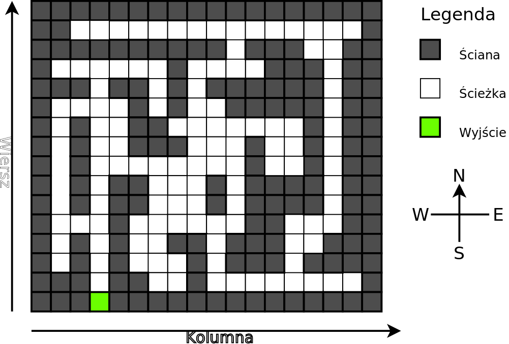

## Zadanie 02
### Idea zadania
Odszukać wyjście z nieznanego labiryntu.

### Na czym polega problem?
Rozpoczynamy wędrówkę po nieznanym labiryncie. Labirynt posiada wiele dróg rozmieszczonych na jednym poziomie planszy do gry. 
Plansza podzielona jest na kwadratowe pola (lokacje) o tym samym rozmiarze. Niektóre z dróg są ślepe. Są i takie, które wprowadzają pętle.

Dodatkowo, do samego labiryntu nie będzie bezpośredniego dostępu. Operacje badania labiryntu można będzie zlecić mojemu 
oprogramowaniu, będzie ono jednak działać wielowątkowo i asynchronicznie.

`Przykładowy labirynt pokazano na obrazku poniżej:`

Lokacja umieszczona w lewym-dolnym rogu labiryntu ma pozycję (row=0, col=0).

### Poszulowanie wyjscia
Poszukując wyjścia należy przestrzegać następujących reguł:
1. Nie wolno wielokrotnie zlecić eksploracji tej samej pozycji labiryntu.
2. Nie wolno zlecić badania pozycji, która nie sąsiaduje bezpośrednio z żadną z wcześniej zbadanych. Chodzi o najbliższe sąsiedztwo w poziomie i pionie (każde położenie ma czterech najbliższych sąsiadów). Można w ten sposób trafić do wnętrza ściany, co jest niedozwolone!
3. Labirynt należy eksplorować w wielu miejscach jednocześnie. Np. jeśli wiemy, że do danej pozycji w labiryncie dotarliśmy idąc na północ i uzyskaliśmy informację, że sąsiaduje ona z pomieszczeniami na południe (droga powrotna), wschód i zachód, to dla pomieszczeń na wschód i zachód należy od razu uruchomić dwa zlecenia eksploracji (oczywiście, o ile pomieszczenia te nie zostały wcześniej zbadane).
4. Generalnie, zawsze należy zlecać eksplorację wszystkich pomieszczeń, które zgodnie z wcześniejszymi punktami, eksplorować już można.

### Informacja zwrotna
Zlecenia będą realizowane "w tle", ale czas realizacji jest ogólnie nieznany. Zlecenia późniejsze mogą zakończyć się wcześniej. 
Zlecenia mogą zakończyć się nawet w tej samej chwili. Każde zlecenie zostanie zrealizowane.

Należy się spodziewać, że każde wywołanie metody `result` z interfejsu `ResultListener` będzie wykonane innym wątkiem.

### Przegrana
Powody porażki:

- Nie zostanie znalezione wyjście. Czas poszukiwań będzie ograniczony, jednak limit będzie na tyle duży, aby poprawnie działający program nie miał problemu ze znalezieniem rozwiązania.
- Kontynuowanie poszukiwań po odkryciu wyjścia. To oczywiście z uwzględnieniem "czasu reakcji" związanym z odebraniem i przetworzeniem informacji o odnalezieniu wyjścia.
- Nieprzestrzeganie reguł poszukiwania wyjścia, w szczególności praca sekwencyjna!
- Nieodbieranie przekazanych informacji
- Wskazanie błędnej lokacji w labiryncie i poza nim
- Trafienie na lokację typu "WALL". Coś takiego nie ma prawa się zdarzyć. Wynik eksploracji zawiera informację o dozwolonych kierunkach ruchu - należy jej używać!
- Używanie CPU w czasie, gdy program nie ma nic do zrobienia, czyli, gdy oczekuje na rezultat zleceń. Nieużywane wątki muszą być usypiane!

### Obserwator
Ponieważ nie wiadomo kiedy zlecenie zostanie zrealizowane przez mój kod, a metod pozwalających na realizację "odpytywania" 
brak, pozostaje użycie wzorca obserwator. Obiekt odbierający zlecenia musi zostać przez Państwa dostarczony przed pierwszym zleceniem. Każde zlecenie będzie otrzymywać unikalny numer. Obserwator będzie otrzymywać informacje o wskazanej lokacji wraz z numerem zlecenia. Dzięki temu będzie możliwe powiązanie wyniku ze zleceniem.

### Komunikacja
- Z Państwa kodem komunikuje się wyłącznie poprzez interfejs `Employer`.
- Przekazuję najpierw obiekt zgodny `OrderInterface`
- Następnie wykonuję w osobnym wątku metodę `start()`, do której trafia położenie początkowe i kierunki w jakich można rozpocząć poszukiwanie wyjścia. Położenie początkowe na pewno jest typu `PASSAGE`.
- Państwa kod przekazuje do mojego za pomocą setResultListener obiekt zgodny z ResultListener.
- Teraz Państwa program może zlecać (metoda order) badanie kolejnych lokacji
- Mój program w dowolnym momencie przekaże wynik zlecenia
- Ostatnie kroki powtarzane są aż do odnalezienia wyjścia.
- Odnalezienie wyjścia powinno zakończyć prace metody `start()`.

### Dostarczenie rozwiązania
Proszę o dostarczenie kodu *źródłowego* klasy `ParallelEmployer`. W klasie można umieścić własne metody i pola. Klasa ma implementować interfejs `Employer`.

Plik z rozwiązaniem może zawierać inne klasy, ale tylko klasa `ParallelEmployer` może być publiczna.

Kodu, który sam dostarczam nie wolno modyfikować. W trakcie testów używany będzie w takiej formie, w jakiej został udostępniony.

Kodu, który sam udostępniam proszę nie dołączać do rozwiązań. Będzie dostępny w trakcie testów.

Programy będą testowane za pomocą Java w wersji 17.

### Dodatek
Dodałem rekord `Location`, który używany jest przez typ wyliczeniowy `Direction`. Można zastosować we własnym rozwiązaniu. 
Można i nie stosować...